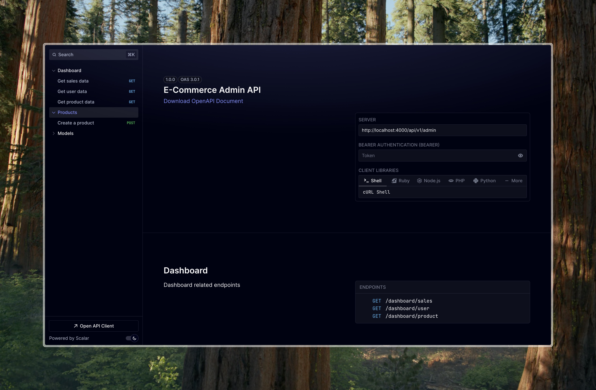

# E-Commerce Project

## Running the Project
1. Copy the `.env.example` file to a new file named `.env`:
    ```bash
    cp .env.example .env
    ```
2. Install Docker if you haven't already: [Docker Installation Guide](https://docs.docker.com/get-docker/)
3. Start the Docker containers in detached mode:
    ```bash
    docker-compose up -d
    ```

## API Documentation Preview
Here is a preview of the Admin API documentation interface:



You can view the full Admin API documentation by visiting [the API documentation page](http://localhost:PORT/api/v1/admin) once the application is up and running.
